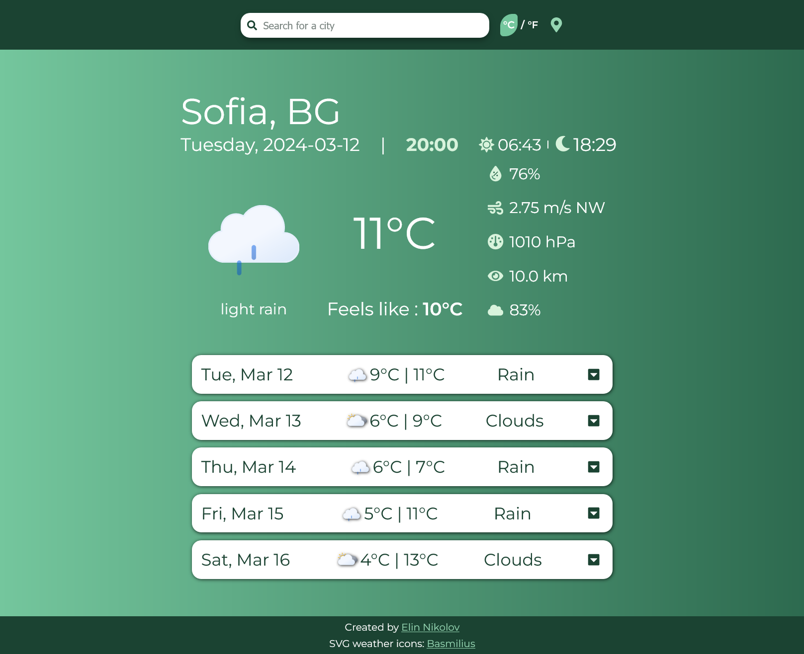
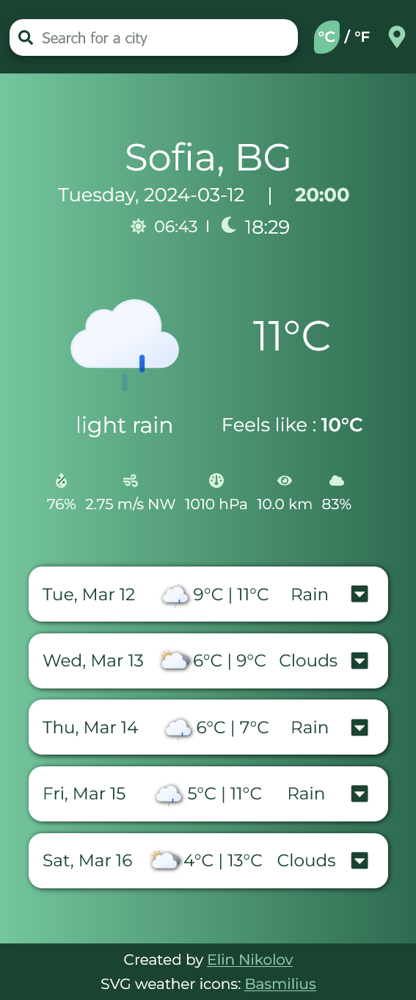
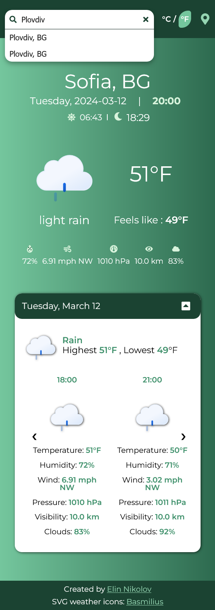

<br/>
<p align="center">
  <a href="https://github.com/Elin4o/weather-api">
    
  </a>

  <h3 align="center">Weather Website Using OpenWeatherAPI</h3>

  <p align="center">
    A small responsive API project
    <br/>
    <br/>
    <a href="https://github.com/Elin4o/weather-api"><strong>Explore the docs »</strong></a>
    <br/>
    <br/>
  </p>
</p>

  

## Table Of Contents

* [About the Project](#about-the-project)
* [Built With](#built-with)
* [Getting Started](#getting-started)
  * [Prerequisites](#prerequisites)
  * [Installation](#installation)
* [Contributing](#contributing)

## About The Project





Yet another weather website, created to broaden my understanding of Typescript and Sass, by getting information from OpenWeather API and displaying it in a simple way. 


## Built With


* [React](https://react.dev/)
* [Typescript](https://www.typescriptlang.org/)
* [Vite](https://vitejs.dev/)
* [Sass](https://sass-lang.com/)


### Prerequisites

* npm

```sh
npm install npm@latest -g
```

### Installation

1. Get a free API Key at [https://openweathermap.org/](https://openweathermap.org/)

2. Clone the repo

```sh
git clone git@github.com:Elin4o/weather-api.git
```

3. Install NPM packages

```sh
npm install
```

4.Create a .env file

5. Enter your API in `.env`

```JS
const VITE_API_KEY = 'ENTER YOUR API';
```

## Contributing


### Creating A Pull Request

1. Fork the Project
2. Create your Feature Branch (`git checkout -b feature/AmazingFeature`)
3. Commit your Changes (`git commit -m 'Add some AmazingFeature'`)
4. Push to the Branch (`git push origin feature/AmazingFeature`)
5. Open a Pull Request

